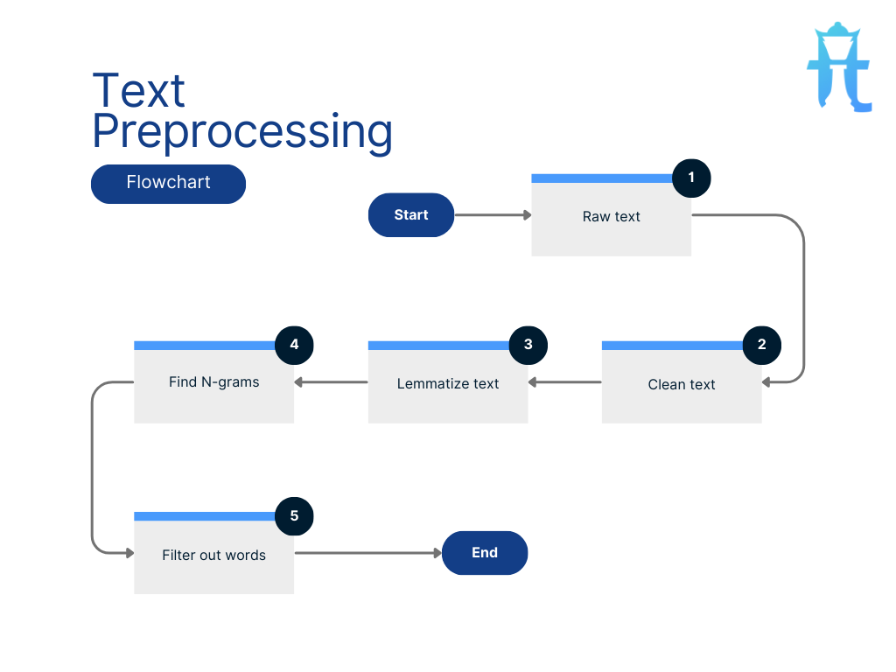
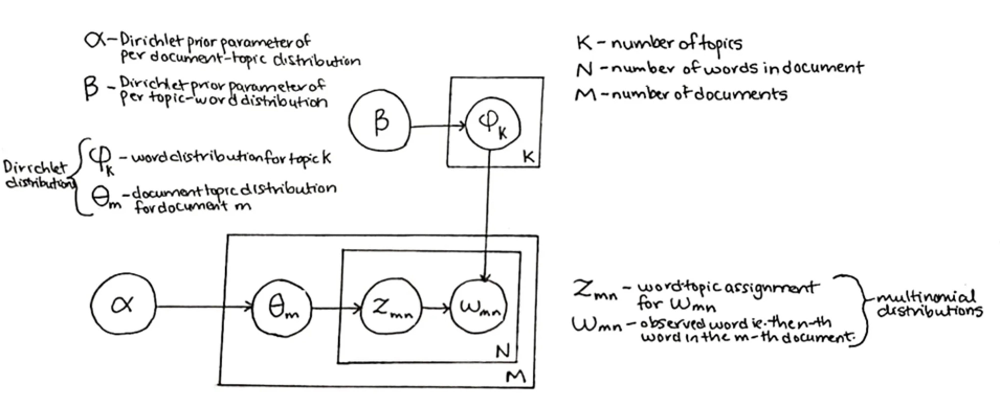
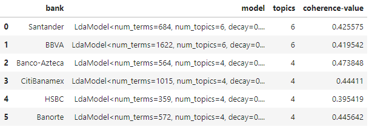
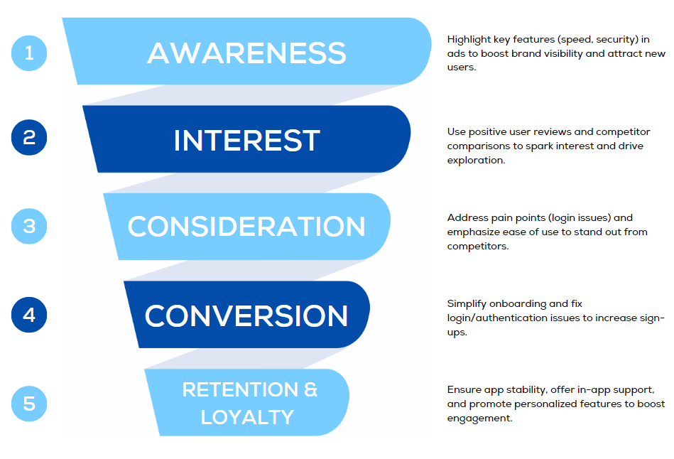

# What NLP Reveals About Mexican Banking Apps

- [Context](#context)
- [Market Share and Competitors in Mexican Banking Apps](#market-share-and-competitors-in-mexican-banking-apps)
- [The Importance of Sample Size in Analyzing Bank App Reviews](#the-importance-of-sample-size-in-analyzing-bank-app-reviews)
- [Segmenting the Competitive Landscape of Mexican Banking Apps](#segmenting-the-competitive-landscape-of-mexican-banking-apps)
- [The Importance of Sample Size in Analyzing Bank App Reviews](#the-importance-of-sample-size-in-analyzing-bank-app-reviews)
- [Why Does ANOVA Matter?](##why-does-anova-matter?)
- [Key Findings: Uncovering Differences in Banking App Ratings](#key-findings-uncovering-differences-in-banking-app-ratings)
   + [Market research analysis - notebook](market-research.ipynb)
- [Next Steps: Extracting Deeper Customer Insights Using LDA for Topic Modeling](#next-steps-extracting-deeper-customer-insights-using-lda-for-topic-modeling)
   + [How Does Preprocessing Help LDA?](#how-does-preprocessing-help-lda)
   + [What is LDA (Latent Dirichlet Allocation)?](#what-is-lda-latent-dirichlet-allocation)
- [Customer Insights from LDA Analysis of Banking Apps][#customer-insights-from-lda-analysis-of-banking-apps]
   + [Reviews analysis - notebook](reviews-analysis.ipynb)
- [Target Market for Mobile Banking Users](#target-market-for-mobile-banking-users)
- [From Awareness to Loyalty](#from-awareness-to-loyalty)
- [Conclusion](#conclusion)
   + [General Recommendations](#general-recommendations)
   + [Final Takeaway](#final-takeaway])

## Context

The **Comisión Nacional Bancaria y de Valores (CNBV)** reports a remarkable surge in mobile banking usage in Mexico. By the first quarter of 2024, 87 million accounts were actively transacting via mobile devices—a significant jump from 82 million accounts recorded just two quarters earlier, in Q3 2023. This upward trend reflects the growing reliance on mobile technology for convenient and accessible financial transactions.

Since Q1 2017, mobile banking accounts in Mexico have grown more than sevenfold, skyrocketing from 11.8 million to the current 87 million, with an impressive average annual growth rate of 14.2%. This rapid expansion underscores the increasing importance of mobile platforms in Mexico’s financial ecosystem.

However, the adoption of mobile banking is not uniform across the country. Regions such as the northern states and the Yucatán Peninsula are at the forefront of digital inclusion, while Mexico City leads the way with exceptional penetration rates. In 2023, Mexico City recorded 18.4 million mobile accounts—more than double its adult population of 7.3 million. This equates to a staggering 253 mobile banking accounts per 100 adults, highlighting the capital’s strong embrace of digital banking.

## Market Share and Competitors in Mexican Banking Apps

Six major groups hold 96% of mobile-linked bank accounts. Among them, Grupo Santander holds a 10.24% share, while BBVA and Banco Azteca stand out as market leaders, showcasing rapid growth in their market share.

### Banking Industry Benchmark Analysis

- **Deposit Growth Trends**
  - *Banco Azteca* led the growth in the number of accounts between Q4 2023 and Q1 2024, with a 5.1% increase. In contrast, *Grupo Santander* saw a decline of -0.81%, falling below the market average of 0.94%. This suggests a potential customer shift towards other institutions.
  
- **Credit Market Insights**
  - *Santander* holds a notable position in the credit market with an 8.43% share. However, it lags significantly behind *BBVA*, which commands 20.11%, and *Banco Azteca*, the market leader with 24.39%.
  
- **Delinquency Rates**
  - In 2024, *Grupo Santander* reported a delinquency rate of 2.26%, higher than *BBVA's* 1.67%, but notably lower than *Banco Azteca's* 3.49%. This indicates that while *Banco Azteca* has expanded its customer base, it faces a higher credit risk among its clients.
  
- **Conclusion**
  - *Banco Azteca's* aggressive growth in account numbers and its dominant position in the credit market highlight its expanding influence in the financial sector. However, this rapid expansion comes with increased credit risk, as reflected in its higher delinquency rates. Meanwhile, *Grupo Santander*, despite a respectable share in the credit market, faces challenges with declining deposits and relatively higher delinquency compared to *BBVA*. These trends suggest that while *Banco Azteca* is capitalizing on growth opportunities, maintaining credit quality will be crucial for sustainable success. Conversely, *Grupo Santander* may need to focus on improving customer retention and managing credit risk to remain competitive.
 
### Analyzing Customer Experience in Banking Apps

An analysis of user ratings on **Google Play** highlights a clear hierarchy among Mexico's mobile banking apps. **Banorte** and **Banco Azteca** emerge as the top performers, earning high marks for customer satisfaction and demonstrating well-executed digital strategies. On the other hand, **BBVA** trails behind, signaling substantial room for improvement in delivering a better user experience. **Santander**, while not leading, secures a respectable third place with steady performance.

To deepen the analysis, we examined highlighted reviews—those deemed most relevant or popular by users. These reviews provide valuable insights into customer sentiment, revealing key preferences, recurring pain points, and desired features. This feedback offers a treasure trove of actionable intelligence that banks can leverage to refine their apps, enhance user retention, and sharpen their competitive positioning in Mexico's increasingly digital-first financial landscape.

An analysis of average user ratings reveals a notable contrast in performance among Mexico's mobile banking apps. **Banco Azteca** consistently shines as the top performer, achieving the highest levels of user satisfaction. In stark contrast, **BBVA** struggles at the other end of the spectrum, recording the lowest average rating.

This disparity underscores **Banco Azteca's** effective focus on delivering a seamless user experience, setting a benchmark for the industry. Meanwhile, the challenges faced by **BBVA** highlight critical areas for improvement, offering an opportunity to enhance its app’s performance and better align with customer expectations.

## Segmenting the Competitive Landscape of Mexican Banking Apps

By analyzing key factors such as mobile app user ratings, deposit growth trends, credit market insights, delinquency rates, branch networks, and overall market share, we've identified distinct clusters within the customer segments of Mexican banks.

- **Market Leader:** BBVA stands out as the clear frontrunner, dominating the market with a strong user base and extensive branch network. Its leadership position is bolstered by solid deposit growth and a wide-reaching credit market presence.
- **Strong Challengers:** Santander and Banamex are positioned as formidable competitors within the same cluster. They are closely contesting BBVA's lead by enhancing their digital offerings and expanding their market share.
- **Opportunities Cluster:** Banco Azteca emerges in a separate segment we call the **"Opportunities"** cluster. While it shows significant potential for growth, particularly in increasing its market share, it faces challenges with higher delinquency rates. Addressing these issues could unlock substantial improvements in performance and customer satisfaction.
- **Niche & Emerging Players:** Banks like Banregio and HSBC, which hold smaller market shares, fall into the **"Niche & Emerging"** segment. These institutions focus on specific market areas or are leveraging emerging opportunities, highlighting their strategic emphasis on specialized services or untapped markets.

This segmentation not only maps out the current competitive landscape but also sheds light on areas where each bank can innovate and improve. Understanding these clusters allows for targeted strategies to enhance user experience, optimize financial products, and ultimately, strengthen their positions in Mexico's dynamic banking sector.

## The Importance of Sample Size in Analyzing Bank App Reviews

When evaluating user reviews for banking apps, the sample size plays a critical role in ensuring that insights are reliable and representative of the broader user base. An adequate sample size not only enhances the accuracy of your analysis but also minimizes the risk of skewed or biased conclusions. By capturing genuine patterns in user feedback, a well-determined sample size lays the foundation for robust, data-driven decisions.

---

### Why Does Sample Size Matter?
- **Accuracy and Representativeness**
    - A small sample size may fail to capture the overall sentiment or user experience, skewing results with extreme reviews—whether overly positive or negative. In contrast, a larger sample size provides a more balanced perspective, reflecting the true diversity of user feedback.  

- **Statistical Significance**
    - Insufficient sample sizes can lead to conclusions driven by random chance rather than meaningful trends. For instance, if only 20 users out of millions rate an app poorly, this might not indicate a widespread issue. A larger sample size ensures statistical validity, uncovering genuine patterns in the data.  

- **Reduced Margin of Error**
    - Larger sample sizes reduce the margin of error, increasing confidence in your findings. For example, if 5% of users in a small sample rate an app poorly, the actual percentage across the entire user base could differ significantly. A sufficient sample size narrows this discrepancy.  

- **Informed Decision-Making**
    - Banks rely on user reviews to guide product improvements, resolve issues, and prioritize feature updates. A representative sample ensures that decisions are aligned with the needs of the majority, avoiding overreactions to outlier opinions.  

---

### Calculating the Optimal Sample Size
To determine the appropriate sample size for review analysis, consider the following key factors:

- **Desired Confidence Level:** Typically set at 95%, this measures the likelihood that your sample reflects the true population sentiment.
- **Margin of Error:** The acceptable range of deviation from the true value (e.g., ±5%). A smaller margin of error requires a larger sample size.
- **Population Size:** The total number of reviews or users.

You can use this formula to calculate sample size:

$$ n = \frac{Z^2 * p * (1-p)}{e^2} $$

Where:
- n = required sample size
- Z = Z-score (1.96 for a 95% confidence level)
- p = estimated proportion (e.g., percentage of positive reviews, often assumed to be 50% for maximum variability)
- e = margin of error

Ensuring a sufficient sample size is essential for delivering meaningful insights that banks can trust. By prioritizing statistical rigor, you can uncover actionable feedback and support informed, impactful decisions in the competitive world of mobile banking.

---

#### Key Considerations for Analyzing Bank App Reviews

Our analysis highlights two critical factors to consider when determining the appropriate sample size for bank app reviews:

1. **Large User Base Requires Statistically Significant Samples**
    - For bank apps with millions of users, a sample size of around 385 reviews is generally sufficient to achieve a 95% confidence level, as previously calculated. This ensures that the insights drawn are both statistically significant and representative of the broader user experience, enabling banks to make data-driven decisions with confidence.  

2. **High Variability in User Feedback**
    - Reviews for banking apps often vary significantly due to factors such as device compatibility, regional differences, and individual expectations. To address this variability, an estimated proportion (𝑝) of 0.5 is recommended in sample size calculations. This assumption maximizes variability, enhancing the reliability of the analysis by accounting for a wide range of possible user sentiments.  

By considering these factors, banks can ensure that their review analysis is robust, reflective of the diverse customer base, and capable of uncovering actionable insights to improve their digital offerings.

---

#### Key Findings from the Analysis

With a robust sample size ensuring statistical reliability, our analysis reveals clear winners and areas of opportunity within Mexico’s mobile banking app landscape.

- **Top Performers: Banorte and Banco Azteca**
    - Banorte and Banco Azteca stand out as the highest-rated banking apps, consistently receiving positive feedback from users. Their strong user ratings reflect well-executed digital strategies and a customer-centric approach that clearly resonates with their audience.  

- **Opportunity for Improvement: BBVA**
    - Despite being the market leader in Mexico, BBVA lags behind in app performance, as indicated by user feedback. While its large customer base gives it a strategic advantage, the app’s lower ratings highlight key areas for improvement. Addressing these pain points presents a valuable opportunity for BBVA to strengthen its user experience and solidify its competitive position in an increasingly digital-first market.  

These findings provide a roadmap for understanding user sentiment and identifying where banks should focus their digital transformation efforts to stay ahead in Mexico's fast-evolving banking sector.

## Why Does ANOVA Matter?

Banks rely on user feedback to gauge customer satisfaction and improve their digital offerings. By applying ANOVA, we can confidently identify which banking apps are performing better and which ones have room for improvement. This approach provides data-backed insights, allowing banks to move beyond speculation and make strategic decisions that directly impact user experience.

- For instance:
    - BBVA may have a lower user rating compared to Banorte and Banco Azteca, but is this difference significant enough to require action?
    - ANOVA helps answer this question with statistical rigor, ensuring that banks allocate resources to areas with the most potential impact.

### Checking Assumptions Before Running ANOVA

Before applying ANOVA, it's essential to ensure that certain statistical assumptions are met. Two key assumptions are:

1. Normal Distribution: User ratings should follow a normal distribution.
2. Homogeneity of Variances: The variance of ratings across bank apps should be similar.

If these assumptions are violated, ANOVA may produce misleading results. To address this, a non-parametric test like the Kruskal-Wallis test can be used as an alternative. Unlike ANOVA, the Kruskal-Wallis test does not require normality or homogeneity of variances, making it a more flexible option for analyzing user feedback that doesn't fit the ideal distribution.

By leveraging ANOVA (or its non-parametric alternative) to analyze app ratings, banks can gain a deeper understanding of customer sentiment, prioritize areas for improvement, and maintain a competitive edge in Mexico's fast-growing mobile banking market.

### When Normality Fails: Using the Kruskal-Wallis Test to Compare Banking App Ratings

In our previous analysis, we observed that user ratings do not follow a normal distribution, which is a key assumption for applying ANOVA. This means that using ANOVA in this context could lead to inaccurate conclusions.

**The Alternative: Kruskal-Wallis Test**  
When the assumption of normality is violated, the Kruskal-Wallis test becomes a more suitable option. This non-parametric statistical test is designed to compare the medians of two or more independent groups, rather than their means, to determine if there are significant differences between them. Unlike ANOVA, it does not require the data to follow a normal distribution or exhibit homogeneity of variances.

**Why Use the Kruskal-Wallis Test?**
- *Robust to Non-Normal Data:* Unlike ANOVA, the Kruskal-Wallis test works well with data that deviate from normality, making it ideal for analyzing user ratings from app reviews.
- *Focus on Medians, Not Means:* Since the test compares medians, it provides a more accurate assessment of differences in central tendency, especially when extreme values (outliers) could skew the results.
- *Applicable to Multiple Groups:* Like ANOVA, it allows for the comparison of three or more groups—perfect for assessing user feedback across banking apps like BBVA, Banorte, and Banco Azteca.

By using the Kruskal-Wallis test, we ensure that our analysis remains statistically sound, even in the face of non-normal data. This approach provides a more accurate view of how customer sentiment differs across banking apps, allowing banks to make well-informed, data-driven improvements to their digital platforms.

#### Dunn's Test: Pinpointing Specific Differences in Bank App Ratings

When analyzing multiple banking apps, tests like ANOVA or Kruskal-Wallis help us determine if there is a significant difference between the groups. However, these tests only reveal that a difference exists — they don't tell us which specific groups are different. This is where Dunn's Test becomes essential.

**What is Dunn's Test?**

Dunn's Test is a post hoc analysis used after detecting a significant difference with a Kruskal-Wallis or ANOVA test. Its main purpose is to conduct pairwise comparisons between groups, allowing us to identify exactly which pairs of groups differ significantly.

For example, imagine we have three banks:
- Bank A
- Bank B
- Bank C

If a Kruskal-Wallis test reveals a significant difference among these banks, Dunn's Test would then compare the groups as follows:
- Bank A vs. Bank B
- Bank A vs. Bank C
- Bank B vs. Bank C

If the comparison between Bank A and Bank B shows a p-value below 0.05, this indicates a statistically significant difference in user ratings between the two banks.

**Why is Dunn's Test Important?**

1. Identifies Specific Differences
    - While Kruskal-Wallis tells us that "at least one bank is different," Dunn's Test reveals which banks differ. This is crucial for identifying specific competitors that are outperforming or underperforming.

2. Reduces Risk of Error
    - When making multiple comparisons, the chance of a false positive (Type I error) increases. Dunn’s Test addresses this by adjusting p-values using methods like the Bonferroni correction, ensuring that the results remain statistically sound.

3. Drives Targeted Improvement
    - Knowing which specific banks have better or worse ratings allows for targeted action. For example, if Bank A significantly underperforms compared to Bank B, the insights can be used to prioritize feature updates, resolve customer pain points, or refine marketing strategies.

**Summary**
- Use Dunn's Test after identifying significant differences with Kruskal-Wallis or ANOVA.
- It identifies which specific banks differ by conducting pairwise comparisons.
- It reduces the risk of false positives by adjusting for multiple comparisons (e.g., using the Bonferroni correction).
- It helps banks take targeted action to address specific weaknesses and close performance gaps.
- By incorporating Dunn's Test into your analysis, you can move beyond general observations and take precise, data-driven actions to improve customer satisfaction and maintain a competitive edge in the banking app landscape.

## Key Findings: Uncovering Differences in Banking App Ratings
Our analysis reveals statistically significant differences in user ratings among the key competitors in the market. By leveraging statistical methods like the Kruskal-Wallis test and Dunn's Test, we were able to pinpoint which banks are outperforming their rivals and, more importantly, where improvements are needed.

### Why Do These Findings Matter?

Identifying significant differences in app performance provides actionable insights that go beyond basic observations. This analysis allows banks to prioritize initiatives that have a direct impact on customer experience and market positioning. Here’s how it can be applied:

- Pinpoint Areas for Improvement
    - By identifying which banks are underperforming relative to their competitors, specific pain points can be addressed, such as app speed, user interface, or security concerns.
- Optimize User Experience
    - Addressing user complaints and improving app features leads to a more seamless and enjoyable customer experience, directly impacting user satisfaction.
- Data-Driven Decision Making
    - Instead of relying on assumptions, banks can make informed decisions on which app features to enhance, which pain points to prioritize, and which competitor strategies to follow or counter.

### Why It Matters for Business Growth

Enhancing user experience isn't just about satisfaction — it has a direct impact on business outcomes:
- **Higher Customer Retention:** A better app experience reduces churn, keeping customers engaged and loyal.
- **Increased Customer Loyalty:** Positive user experiences drive long-term brand loyalty and encourage repeat usage.
- **Higher Conversions & Engagement:** A well-performing app can lead to higher engagement, more transactions, and increased app usage.

By focusing on the findings from the Kruskal-Wallis and Dunn’s Test, banks can adopt a more strategic approach to product development, driving better customer experiences and ultimately improving market share and brand loyalty.

## Next Steps: Extracting Deeper Customer Insights Using LDA for Topic Modeling

To better understand **customer experience (CX)** and how users interact with banking apps, we now turn to **Latent Dirichlet Allocation (LDA)** — a powerful technique for topic modeling. This next phase of analysis will allow us to uncover the hidden themes in user reviews and extract actionable insights to improve app performance and customer satisfaction.

However, for LDA to deliver meaningful results, it’s essential to prepare the text data properly. Raw review text is often messy, unstructured, and filled with irrelevant information that can distort the analysis. This is why data preprocessing is a crucial step before running LDA.

#### What is LDA, and Why Does Preprocessing Matter?

LDA (Latent Dirichlet Allocation) is a machine learning algorithm used to identify hidden topics within large text datasets. It works by clustering words that frequently appear together into distinct topics, which provides a clearer understanding of the core themes present in customer reviews. For example, if customers frequently mention "login issues," "password problems," and "security," LDA might classify these words into a single “Account Access Issues” topic.

But here’s the catch: LDA is only as effective as the quality of the data you feed it. Without preprocessing, noisy, irrelevant, or unstructured data can result in vague or meaningless topics. Imagine if random numbers, emojis, or repeated stopwords like "the" or "and" are included — they can confuse the model and produce cluttered, unhelpful results.

#### How Does Preprocessing Help LDA?

Preprocessing ensures that only relevant, high-quality text data is used in LDA, leading to more coherent and meaningful topics. Here’s why preprocessing is essential:
- Removes Noise: Filters out irrelevant data such as punctuation, special characters, and emojis.
- Reduces Redundancy: Eliminates stopwords (like “the”, “is”, “in”) that don’t add meaning to the analysis.
- Standardizes Text: Converts text to lowercase and applies stemming/lemmatization to group similar words (e.g., “running” and “ran” become “run”).
- Improves Interpretability: Clean data ensures that the topics extracted by LDA are more interpretable and useful for decision-making.

**What’s Next?**

In the next section, I’ll guide you through a step-by-step preprocessing pipeline that will transform raw text into clean, LDA-ready data. You’ll see how each stage — from tokenization to stopword removal and lemmatization — plays a role in improving the quality of the analysis. By the end, you'll have a clean dataset ready to extract powerful customer experience insights from user reviews.

This process will pave the way for identifying key issues, customer pain points, and opportunities for app enhancement — all through the lens of LDA.

**Preparing Text for LDA: The Essential Preprocessing Workflow**

Before running the LDA (Latent Dirichlet Allocation) algorithm, it's crucial to prepare the text properly. Raw text is often messy, noisy, and unstructured, which can mislead the algorithm and produce irrelevant or incoherent topics. To ensure meaningful and actionable insights, we follow a systematic preprocessing workflow that includes cleaning, lemmatizing, creating n-grams, and filtering out unnecessary words.

This process allows LDA to focus on the most important words, uncovering clear and interpretable topics. Here’s how each step contributes to better results.

1️⃣ *Clean the Text*

What It Is: 
- Cleaning the text involves removing unnecessary elements such as:
    - Punctuation (e.g., !, ?, ,, .)
    - Numbers (e.g., 123, 2024)
    - Special symbols (e.g., @, #, 🦊, 🐶)
    - Stopwords (e.g., "and," "is," "the")

Additionally, all text is converted to lowercase so that "Machine Learning" and "machine learning" are treated as the same entity, not separate words.

Why It Matters:
- Cleaning eliminates noise that could distract the algorithm from identifying key patterns. By focusing on the core words, we improve the relevance of the final topics.

Example:
- Raw text: "The quick brown fox jumps over 2 lazy dogs!! 🦊🐶"
- Cleaned text: "quick brown fox jumps lazy dogs"

2️⃣ *Lemmatize the Text*

What It Is: 
- Lemmatization reduces words to their root form or "dictionary form." Unlike stemming (which just removes suffixes), lemmatization returns valid words. For instance:
    - "running," "ran," "runs" → "run"
    - "children" → "child"

Why It Matters:
- Without lemmatization, LDA would treat variations of a word (e.g., "run" vs. "running") as separate words, reducing the clarity of topics. By grouping them into a single root form, the algorithm can better identify word patterns and improve topic coherence.

Example:
- Original text: "Dogs are running in the park."
- Lemmatized text: "dog be run in the park"
  
3️⃣ *Find N-Grams*

What It Is: 
- N-grams are combinations of N consecutive words that frequently appear together.
    - Unigrams (1 word): "machine", "learning", "model"
    - Bigrams (2-grams): "machine learning", "data analysis"
    - Trigrams (3-grams): "machine learning model", "natural language processing"

Why It Matters:
- Some concepts are better represented as phrases rather than individual words. For example, "New York" carries more meaning as a unit than as "New" and "York" separately. Without n-grams, LDA may fail to recognize the relationship between adjacent words, making topics less coherent.
  
Example:
- Text: "I love machine learning models."
- Bigrams: ["machine learning", "learning models"]
- N-grams help LDA recognize important multi-word phrases, improving the clarity and relevance of the extracted topics.

4️⃣ *Filter Out Words*

What It Is: 
- Filtering involves removing words that are either:
    - Too common (like "great" or "good") — These words dominate topics, making them too broad.
    - Too rare (like "obscuretermxyz") — Rare words provide little insight and add noise to the analysis.

Why It Matters:
- If extremely common words (like "good" or "people") are not filtered out, they will dominate the LDA topics, making them overly generic. Conversely, rare words that appear only once or twice add noise without contributing meaningful insights. By filtering these words, the model becomes more focused on relevant, impactful terms.

Example:
- Original list of words: ["machine", "learning", "data", "great", "obscuretermxyz"]
- Filtered list: ["machine", "learning", "data"]
- This step is essential for identifying specific, valuable topics instead of generic categories.

#### What is LDA (Latent Dirichlet Allocation)?

Latent Dirichlet Allocation (LDA) is one of the most widely used algorithms for topic modeling, a method that uncovers hidden themes or topics in large collections of text. Essentially, LDA helps group words into clusters, where each cluster represents a distinct topic. If you've ever wondered how to automatically identify the main ideas within a set of reviews, news articles, or social media comments — LDA is your go-to tool.

How Does LDA Work?

To understand LDA, it's helpful to break down its two key assumptions:
- Documents Contain a Mix of Topics
    - Each document (like a review, comment, or news article) is composed of multiple topics in varying proportions. For example:
        - A news article might be 60% politics and 40% technology.
        - A customer review might be 70% product quality and 30% shipping experience.
- Topics Are Made Up of Related Words
    - Each topic is defined by a group of words that frequently appear together. For example:
        - A “sports” topic might include words like “game,” “team,” and “score.”
        - A “customer experience” topic could have words like “support,” “help,” and “wait time.”

**How Does LDA Identify Topics?**

LDA works through an iterative probabilistic process:
- It assigns a probability for each word in a document to belong to a particular topic.
- It determines the proportion of topics within each document.
- It refines these probabilities over several iterations until it reaches a stable result.

*Here’s a simplified example:*
- Input: Reviews from a mobile banking app.
- Output: LDA identifies key topics like:
- Topic 1: User Experience (words like "easy," "fast," "simple")
- Topic 2: Security Issues (words like "login," "password," "fraud")
- Topic 3: Customer Support (words like "help," "response," "agent")

Each review is then assigned a percentage mix of these topics, so you can understand which issues customers care about most.

**Why is LDA Useful?**

LDA is powerful because it allows you to extract key themes from large, unstructured text datasets without manual labeling. It’s especially useful for:
- Customer Feedback Analysis: Uncover customer pain points in reviews and identify the most common areas of concern.
- Content Categorization: Automatically group news articles, research papers, or social media posts into categories.
- Market Research: Understand consumer sentiment and emerging trends in product reviews.

With LDA, you move beyond surface-level analysis and gain a deeper understanding of the hidden patterns in your data, making it an essential tool for customer experience insights, business strategy, and content analysis.

**What is LDA Coherence and Why Does It Matter?**

When you use **LDA (Latent Dirichlet Allocation)** for topic modeling, one key challenge is figuring out how many topics to choose. This is where the Coherence Score comes in. It’s a metric that tells you how "meaningful" or "understandable" the topics are.

Here’s a simple way to think about it:
- Imagine you’re clustering customer reviews, and LDA identifies a topic that includes the words:
    - ["bank," "deposit," "withdrawal," "account"]

This makes sense as a topic because all these words are related to banking services. The coherence score measures how well the words in a topic stick together logically. The higher the score, the more coherent (and useful) the topic is. If, on the other hand, the words in a topic were ["bank," "pizza," "rocket"], the coherence score would be much lower because these words don’t naturally fit together.

When running LDA, you can test different numbers of topics (like 5, 10, 20, etc.) and use the coherence score to select the best number. The goal is to find the "sweet spot" where the topics are meaningful and not too general or too specific.As shown in the following table, we can track the performance of each banking application.

#### Customer Insights from LDA Analysis of Banking Apps**

Our analysis of customer feedback from key Mexican banking apps, using LDA (Latent Dirichlet Allocation), reveals critical insights into user experience (UX), key pain points, and growth opportunities for each bank. Here’s a concise summary of the most actionable findings for Santander, BBVA, Banco Azteca, Citibanamex, HSBC, and Banorte.

**Santander - Key Insights**
- Top Issues:
    - Branch Dependency: Users are frustrated by the need to visit branches for token-based transactions and certain services.
    - Technical Failures: Recurring technical issues after updates, particularly affecting transfers.
    - Device Change Complications: The process for switching devices is cumbersome, especially for token reactivation.
- Positive Aspects:
    - Users appreciate improvements in speed, interface, and functionality.
- Opportunities for Improvement:
    - Digitize essential services to reduce branch reliance.
    - Stabilize critical functions (e.g., transfers) to prevent failures after updates.
    - Simplify device migration by creating an intuitive process with interactive guides.

**BBVA - Key Insights**
- Top Issues:
    - Login and Authentication Issues: Login failures, especially biometric login (fingerprint, facial recognition).
    - Branch Dependency: Reliance on physical branches for card and payment-related services.
    - Transfer Failures Post-Update: Recent updates caused issues with money transfers, a critical feature for users.
- Positive Aspects:
    - Some users appreciate app improvements in speed and user interface design.
- Opportunities for Improvement:
    - Enhance login stability by optimizing biometric access and offering alternative login options.
    - Prioritize transfer stability and rigorously test updates before release.
    - Minimize branch reliance by digitizing card and payment-related operations.

**Banco Azteca - Key Insights**
- Top Issues:
    - Branch Dependency: Users still rely on physical branches for basic operations like payments and credit management.
    - Technical Issues Post-Update: Updates introduce new problems, especially related to app access and login.
    - Frustration with Credit Services: Users face issues with credit and collection processes, often leading to negative sentiment.
- Positive Aspects:
    - Customers appreciate the app's speed, ease of use, and simplicity, which is seen as a competitive advantage.
- Opportunities for Improvement:
    - Digitize essential services (e.g., payments and credit management) to reduce branch reliance.
    - Improve technical stability by ensuring updates are thoroughly tested before release.
    - Improve communication to clarify credit processes and prevent confusion regarding collections and payments.

**Citibanamex - Key Insights**
- Top Issues:
    - Transaction Visibility Issues: Users struggle to view transactions and balances, leading to confusion and frustration.
    - Transfer Issues and Slowness: Transfers are slow and fail at times, especially after updates.
    - Branch Dependency: Users still rely on physical branches for tasks like card management and payments.
- Positive Aspects:
    - Users appreciate the app's security, speed, and simple navigation.
- Opportunities for Improvement:
    - Improve transaction visibility by offering real-time updates and clear presentation of transactions and balances.
    - Ensure transfer stability and conduct thorough testing before updates are released.
    - Digitize key processes (like card management) to reduce the need for physical branch visits.

**HSBC - Key Insights**
- Top Issues:
    - Account and Transfer Issues: Recurring failures in transfers and problems managing accounts.
    - Authentication Issues: Token-based login issues cause frustration for users trying to access the app.
    - Limited App Availability: Users report that certain app features are unavailable during specific hours (like nighttime), causing inconvenience.
- Positive Aspects:
    - Users appreciate the app's security, speed, and reliability when it functions as intended.
- Opportunities for Improvement:
    - Ensure 24/7 app availability and remove time-based service restrictions.
    - Enhance token-based login stability to avoid lockouts and technical failures.
    - Optimize customer service with in-app support to address user concerns more efficiently.

**Banorte - Key Insights**
- Top Issues:
    - Authentication and Access Issues: Users experience problems with login, errors, and issues with mobile authentication.
    - Slow Performance: Users report delays when performing critical functions like transfers and payments.
    - Branch Dependency: Users must visit branches or use ATMs for certain tasks, reducing their autonomy.
- Positive Aspects:
    - Banorte is praised for its ease of use, speed, and intuitive design, which is a competitive advantage.
- Opportunities for Improvement:
    - Fix login and authentication issues to provide a smooth, error-free access experience.
    - Improve transaction speed by optimizing backend systems to reduce wait times for transfers and payments.
    - Increase digital service options to minimize branch dependency and enhance user autonomy.

**General Takeaways for Banking Apps**

Across all banks, some common themes emerged that present opportunities for industry-wide improvement:
- Technical Stability: Many apps experience functionality issues post-update, especially affecting transfers and login authentication.
- Branch Dependency: Users still rely on physical branches for essential services. There’s a clear demand for greater digital autonomy.
- Login and Authentication: Failures in login (especially with biometrics) are a key source of frustration. Banks must optimize biometric systems and offer alternatives for seamless access.
- Customer Sentiment: While users highlight some positive aspects (like speed, security, and ease of use), negative feedback often centers on technical issues, slow functionality, and confusing processes.

**Actionable Recommendations for Banks**

To improve customer experience and app performance, banks should prioritize the following actions:
1. Stabilize Login and Authentication: Ensure users can log in consistently, with stable biometric access and support for multiple devices.
2. Enhance Update Reliability: Roll out updates only after rigorous testing to avoid disruptions to key features like transfers and payments.
3. Reduce Branch Dependency: Digitize processes like card management, transfers, and payments to eliminate the need for branch visits.
4. Improve Transaction Visibility: Allow users to view transactions, balances, and account information in real time, with options for sharing or exporting statements.
5. Optimize Performance and Speed: Speed up slow processes, reduce loading times, and ensure smooth navigation, especially for core features like transfers and payments.
6. Customer-Centric Design: Simplify user flows, especially for key processes like device migration, payments, and logins, to reduce frustration.

**Findings**

This LDA-based analysis sheds light on the critical areas for improvement and key strengths of the most popular banking apps in Mexico. While some apps, like **Banorte** and **Banco Azteca**, are praised for their speed and simplicity, others, like **HSBC** and **Citibanamex,** face significant issues related to technical stability, login failures, and branch dependency.

The analysis also highlights **cross-industry opportunities** for all banking apps, especially around **login reliability, transfer stability, and digital autonomy.** By addressing these pain points, banks can enhance customer experience, improve satisfaction, and increase app usage — all of which contribute to better customer retention and stronger brand loyalty.

This data-driven approach not only identifies user pain points but also provides banks with clear, actionable recommendations to strengthen their competitive position in the growing digital banking landscape.

## Target Market for Mobile Banking Users

The growth of digital banking solutions has skyrocketed in recent years, driven by increased smartphone usage and the shift toward cashless transactions. As more users turn to mobile banking, understanding their demographic profile, purchasing habits, and daily activities becomes essential for financial institutions seeking to improve user experience and drive engagement.

This next provides a comprehensive overview of the socio-demographic profile, user activity, and purchasing habits of mobile banking users, highlighting key characteristics and actionable insights for banks to optimize their digital offerings.

📊 **Socio-Demographic Profile of Mobile Banking Users**
1. Age Distribution
- The majority of mobile banking users fall within the 18 to 39 age group, making up nearly 60% of total users.
- Older users are a minority, with only 6.1% of users aged 60+, suggesting that digital adoption is still limited among senior citizens.
- This highlights the need for user-friendly, intuitive interfaces that cater to younger, tech-savvy users while still being accessible to older age groups.
  
2. Gender Distribution
- The gender split among users is fairly balanced, with 48% women and 52% men actively using mobile banking services.
- This gender parity indicates a broad appeal across all consumer segments, making it crucial for banks to develop inclusive user experiences that cater to both men and women equally.

📈 **User Activities and Employment Status**
1. Employment Status
- 42.5% of users are employed, while 34.8% are students.
- This means that nearly 7 out of 10 users are actively working or studying, making them highly active in daily financial transactions such as payments, transfers, and shopping.
- The remaining 28% of users are unemployed or retired, representing an opportunity for banks to create targeted solutions for non-working users, such as pension-related services or simpler, frictionless banking tools.
  
2. User Intentions and Engagement
- Employed users are more likely to use banking apps for salary deposits, bill payments, and transfers, while students are more inclined to use them for small payments and e-commerce.
- This insight allows banks to tailor in-app features, such as personalized notifications, financial planning tools, and expense tracking, to meet the specific needs of these two dominant user groups.

🛒 **Purchasing Habits of Mobile Banking Users**
1. What Users Buy Using Mobile Banking
- Mobile banking is no longer limited to transfers and bill payments. Users are increasingly using banking apps to make purchases. Key buying behaviors include:
    - 73% of users purchase clothing and accessories through their mobile banking apps.
    - 48% buy home products, such as furniture, decor, and essential items.
    - 44% purchase food and beverages, reflecting the rise of cashless payments for daily necessities.
    - Only 6.7% of users purchase financial products, such as insurance, investments, or savings tools, indicating an untapped opportunity for banks to promote these services directly through the app.
      
2. Implications for Banks
- The high purchase rates for clothing, home products, and groceries highlight the growing integration of banking apps with e-commerce platforms.
- Banks could consider partnerships with retailers, loyalty programs, and cashback offers to further encourage mobile payments and increase app usage.
- By promoting financial products (like insurance, loans, and savings) directly in the app, banks could tap into the underserved 6.7% segment of users who currently purchase financial products through banking apps.

💡 **Key Takeaways**
1. Young, Tech-Savvy Users Dominate
- The core audience for mobile banking apps is young adults aged 18-39, most of whom are either employed or students. This means banks should prioritize features like quick transfers, frictionless payments, and financial tools that cater to fast-paced, mobile-driven lifestyles.

2. Digital Purchases Are a Key Growth Area
- Users frequently buy clothing, home products, and food using mobile banking apps. This presents an opportunity for banks to create cashback rewards, retailer partnerships, and "Buy Now, Pay Later" (BNPL) options directly within the app.

3. Opportunities for New Products and Services
- Only 6.7% of users purchase financial products through mobile banking apps, leaving room for banks to upsell loans, insurance, and savings products. By promoting these services in a user-friendly and personalized way, banks can drive cross-sell opportunities.

4. Focus on Usability and Digital Autonomy
- With nearly 60% of users under 40 and 28% unemployed or retired, banks must ensure their apps are easy to use for all age groups. This includes features like simple navigation, quick access to funds, and smooth onboarding for users unfamiliar with digital banking tools.

By understanding this target market, banks can tailor their mobile banking strategies to meet the needs of these diverse user groups. From promoting financial products to enhancing app functionality, banks have a unique opportunity to grow user engagement, increase app adoption, and strengthen customer loyalty.

## From Awareness to Loyalty

The analysis of Mexican banking apps reveals critical insights that affect every stage of the acquisition funnel—from awareness to loyalty. By leveraging data-driven insights, banks can attract potential users through targeted marketing that highlights app strengths like speed, security, and ease of use. Addressing pain points like login issues, post-update failures, and branch dependency at the consideration and registration stages ensures a smooth user experience, boosting sign-ups and conversions.

To drive retention and loyalty, banks must prioritize app stability, 24/7 availability, and seamless updates to prevent drop-offs. Additionally, enhancing in-app support and introducing loyalty programs or referral incentives can increase customer lifetime value (CLV). By acting on these insights, banks can create a customer-centric strategy that drives higher app adoption, reduces churn, and strengthens competitive advantage in the fast-growing world of mobile banking.

## Conclusion

The thematic analysis of user reviews for major Mexican banking apps — Santander, BBVA, Banco Azteca, CitiBanamex, HSBC, and Banorte — reveals key patterns, common issues, and areas of opportunity for improvement. While each bank faces unique challenges, certain cross-cutting themes affect the entire industry, presenting clear opportunities for collective improvement. The analysis also highlights Banorte as the best-performing app in terms of user satisfaction, ease of use, and efficiency.

Despite notable progress in digital banking, technical stability, authentication issues, and the continued reliance on physical branches remain persistent challenges for all banking apps. These insights provide a clear roadmap for improving user experience, driving app engagement, and boosting customer retention.

To remain competitive, banks must address technical issues, eliminate branch dependency, and prioritize a user-centric approach. Apps that embrace full digitalization and ensure the stability of key features like transfers, authentication, and login will be best positioned to retain existing users and attract new ones.

By fixing core pain points and enhancing strengths, these banks can establish a competitive advantage in a growing digital market, especially as users increasingly demand seamless, fast, and reliable banking experiences.

---

**Key Findings**

1️⃣ Common Problems Across All Banking Apps
1. Technical Issues & Stability
    - Problem: Updates often cause more issues than they solve, introducing new bugs or disrupting critical functionalities like transfers.
    - Impact: Users lose confidence in the app’s reliability, especially when essential functions fail.
    - Recommendation: Improve testing and quality assurance for all updates, especially for core features like transfers, payments, and login. Roll out updates gradually with rollback options in case of critical issues.
2. Authentication & Login Issues
    - Problem: Biometric authentication (fingerprint, facial recognition) often fails, disrupting access. Device synchronization and login errors further complicate the process.
    - Impact: Frustrated users may abandon the app or reduce usage frequency.
    - Recommendation: Strengthen the biometric authentication system to improve consistency. Offer multiple login options (biometrics, PIN, or SMS) to provide backup access and reduce lockouts.
3. Dependency on Physical Branches
    - Problem: Despite the "digital" nature of banking apps, users are still required to visit branches for basic actions like card management, payments, and troubleshooting.
    - Impact: Users view this as an unnecessary hassle, especially those accustomed to fully digital experiences.
    - Recommendation: Digitize critical processes (like card replacements, credit applications, and payment authorizations) to reduce dependency on branches. Offering live in-app support (chatbots) for customer service can also reduce branch visits.
4. Inconsistent User Experience
    - Problem: Some users praise the app’s ease of use, speed, and security, while others report frustration due to functionality failures.
    - Impact: This inconsistency erodes user trust and creates a sense of unreliability in the app’s performance.
    - Recommendation: Apply user feedback loops to consistently monitor and address pain points. Identify frequently reported issues and resolve them in the next update. Use in-app notifications to communicate to users when issues are resolved.
5. Negative Perception of Updates
    - Problem: Updates often receive mixed feedback. While some users see improvements, others feel the app gets worse (slower, more buggy, or with missing features).
    - Impact: Updates risk damaging user sentiment and can lead to app abandonment if negative changes are frequent.
    - Recommendation: Communicate "What's New" changes clearly before updates, showing users how the update improves their experience. Offer a "beta test" option so users can voluntarily test new versions before public release.

2️⃣ Best-Performing App: Banorte

Based on the analysis of reviews, Banorte stands out as the highest-rated banking app. It excels in critical areas like ease of use, speed, and intuitive design. Compared to other competitors, Banorte users report fewer issues with branch dependency and login challenges.

- Key Strengths:
    - Ease of Use: Users find the app intuitive and simple, requiring fewer clicks and minimal instructions to navigate.
    - Speed: Banorte consistently outperforms its competitors in app speed, ensuring fast transfers and smooth navigation.
    - Security: Users feel secure using the app, with strong support for authentication measures that are perceived as reliable.

- Areas for Improvement:
    - Authentication: Login issues related to biometric access and device synchronization still exist, although they occur less frequently than with other apps.
    - Slow Updates: Some users experience lags in speed, particularly after new updates. Ensuring update stability is crucial for maintaining its market leadership.

Banorte's success demonstrates how prioritizing user-centric features, app stability, and seamless transfers can drive higher user satisfaction.

3️⃣ Key Considerations for All Competitors

1. Technical Optimization
    - What to Do: Ensure every app update goes through rigorous testing and quality control. Prevent "feature regressions" where new updates break key features.
    - Why It Matters: Users expect banking apps to be as reliable as physical bank branches. Any error with transfers, payments, or authentication directly affects user trust.

2. Enhanced Digital Experience
    - What to Do: Eliminate branch dependency by digitizing key processes, such as card issuance, payment authorizations, and credit management.
    - Why It Matters: Users expect modern banking apps to be fully digital. Reducing branch visits creates a stronger value proposition for digital users.

3. User-Centric Design
    - What to Do: Streamline interfaces for simple, intuitive navigation. Make account balances, transaction history, and transfers easy to view and access.
    - Why It Matters: Simplicity drives user satisfaction. Clean, intuitive interfaces reduce learning curves, speed up daily tasks, and improve retention.

4. Transparent Communication
    - What to Do: Communicate app updates clearly. Notify users about new features, resolved issues, and the benefits of updates.
    - Why It Matters: When users understand why an update matters, they are more likely to appreciate it. This increases app engagement and reduces negative reviews.

5. Leverage Positive Feedback
    - What to Do: Identify the features users love (like speed, ease of use, and security) and highlight them in app store listings, marketing materials, and ads.
    - Why It Matters: Users look for reassurance before downloading or switching banking apps. Highlighting positive reviews and awards (like "fastest app") builds brand trust.

--- 

**General Recommendations**

To compete in Mexico's growing digital banking landscape, all apps must address these core challenges:
1. Digitize Core Processes: Allow customers to handle all essential banking tasks—like managing cards and making payments—within the app.
2. Stabilize Updates: Test new features rigorously and communicate changes before release.
3. Improve Authentication Systems: Ensure biometric login works seamlessly, and offer alternative login options (PIN, SMS, or manual).
4. Focus on User-Centric Design: Make navigation intuitive, fast, and easy to use.
5. Reduce Customer Frustration: Use in-app customer support, chatbots, and proactive alerts to resolve issues before users escalate them.

--- 

**Final Takeaway**

Banking apps in Mexico are on a path of continuous improvement, but major issues still exist—branch dependency, login failures, and technical instability being the most prominent. **Banorte** leads the pack in customer satisfaction, thanks to its emphasis on speed, ease of use, and security. However, even Banorte must improve stability after updates and further digitize services to reduce branch visits.

The opportunity for all competitors lies in embracing full digitalization, improving login reliability, and delivering a seamless, fast, and frustration-free user experience. As mobile banking adoption grows, these improvements will increase customer satisfaction, reduce churn, and foster customer loyalty. By learning from this analysis, banks can transform user pain points into competitive advantages and position their apps as the go-to digital banking solution for millions of Mexican users.
