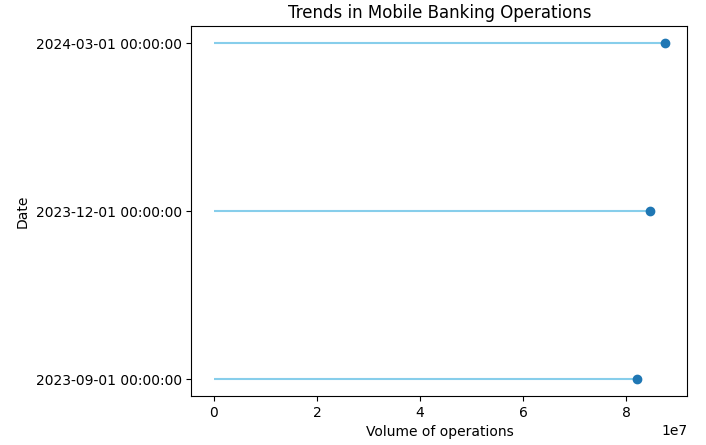
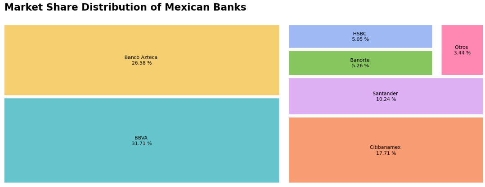
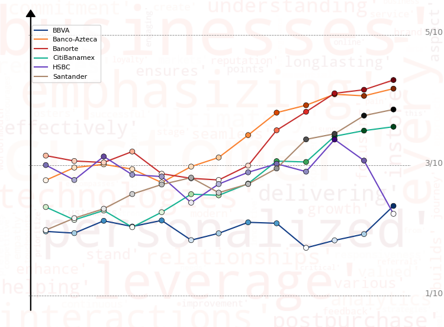
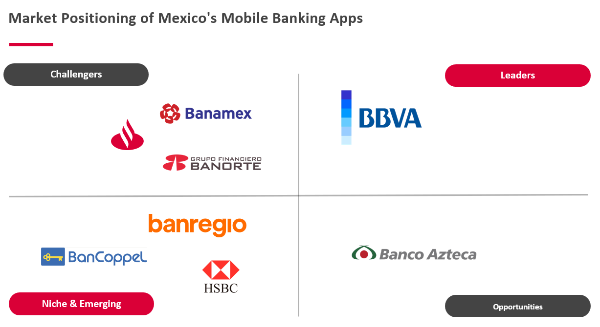

## What NLP Reveals About Mexican Banking Apps

- [Context](#context)
- [Market Share and Competitors in Mexican Banking Apps](#market-share-and-competitors-in-mexican-banking-apps)
   + [Data exploring](data_explorer.ipynb)
- [ML models](#ml-models)
   + [building the model](loyalty_drivers.ipynb)
- [Most important features](#most-important-features)
   + [building SHAP values](loyalty_drivers.ipynb)
- [Budget optimization](#budget-optimization)
   + [building the optimization model](optimizing_loyalty.ipynb)
- [What if scenario](#what-if-scenario)
   + [DiCE model](optimizing_loyalty.ipynb)
- [Findings](#findings)

# Context

The **Comisión Nacional Bancaria y de Valores (CNBV)** reports a remarkable surge in mobile banking usage in Mexico. By the first quarter of 2024, 87 million accounts were actively transacting via mobile devices—a significant jump from 82 million accounts recorded just two quarters earlier, in Q3 2023. This upward trend reflects the growing reliance on mobile technology for convenient and accessible financial transactions.

Since Q1 2017, mobile banking accounts in Mexico have grown more than sevenfold, skyrocketing from 11.8 million to the current 87 million, with an impressive average annual growth rate of 14.2%. This rapid expansion underscores the increasing importance of mobile platforms in Mexico’s financial ecosystem.

However, the adoption of mobile banking is not uniform across the country. Regions such as the northern states and the Yucatán Peninsula are at the forefront of digital inclusion, while Mexico City leads the way with exceptional penetration rates. In 2023, Mexico City recorded 18.4 million mobile accounts—more than double its adult population of 7.3 million. This equates to a staggering 253 mobile banking accounts per 100 adults, highlighting the capital’s strong embrace of digital banking.

# Market Share and Competitors in Mexican Banking Apps

Six major groups hold 96% of mobile-linked bank accounts. Among them, Grupo Santander holds a 10.24% share, while BBVA and Banco Azteca stand out as market leaders, showcasing rapid growth in their market share.

## Banking Industry Benchmark Analysis

- **Deposit Growth Trends**
  - *Banco Azteca* led the growth in the number of accounts between Q4 2023 and Q1 2024, with a 5.1% increase. In contrast, *Grupo Santander* saw a decline of -0.81%, falling below the market average of 0.94%. This suggests a potential customer shift towards other institutions.
  
- **Credit Market Insights**
  - *Santander* holds a notable position in the credit market with an 8.43% share. However, it lags significantly behind *BBVA*, which commands 20.11%, and *Banco Azteca*, the market leader with 24.39%.
  
- **Delinquency Rates**
  - In 2024, *Grupo Santander* reported a delinquency rate of 2.26%, higher than *BBVA's* 1.67%, but notably lower than *Banco Azteca's* 3.49%. This indicates that while *Banco Azteca* has expanded its customer base, it faces a higher credit risk among its clients.
  
- **Conclusion**
  - *Banco Azteca's* aggressive growth in account numbers and its dominant position in the credit market highlight its expanding influence in the financial sector. However, this rapid expansion comes with increased credit risk, as reflected in its higher delinquency rates. Meanwhile, *Grupo Santander*, despite a respectable share in the credit market, faces challenges with declining deposits and relatively higher delinquency compared to *BBVA*. These trends suggest that while *Banco Azteca* is capitalizing on growth opportunities, maintaining credit quality will be crucial for sustainable success. Conversely, *Grupo Santander* may need to focus on improving customer retention and managing credit risk to remain competitive.
 
## Analyzing Customer Experience in Banking Apps

An analysis of user ratings on **Google Play** highlights a clear hierarchy among Mexico's mobile banking apps. **Banorte** and **Banco Azteca** emerge as the top performers, earning high marks for customer satisfaction and demonstrating well-executed digital strategies. On the other hand, **BBVA** trails behind, signaling substantial room for improvement in delivering a better user experience. **Santander**, while not leading, secures a respectable third place with steady performance.

To deepen the analysis, we examined highlighted reviews—those deemed most relevant or popular by users. These reviews provide valuable insights into customer sentiment, revealing key preferences, recurring pain points, and desired features. This feedback offers a treasure trove of actionable intelligence that banks can leverage to refine their apps, enhance user retention, and sharpen their competitive positioning in Mexico's increasingly digital-first financial landscape.

An analysis of average user ratings reveals a notable contrast in performance among Mexico's mobile banking apps. **Banco Azteca** consistently shines as the top performer, achieving the highest levels of user satisfaction. In stark contrast, **BBVA** struggles at the other end of the spectrum, recording the lowest average rating.

This disparity underscores **Banco Azteca's** effective focus on delivering a seamless user experience, setting a benchmark for the industry. Meanwhile, the challenges faced by **BBVA** highlight critical areas for improvement, offering an opportunity to enhance its app’s performance and better align with customer expectations.

## Segmenting the Competitive Landscape of Mexican Banking Apps

By analyzing key factors such as mobile app user ratings, deposit growth trends, credit market insights, delinquency rates, branch networks, and overall market share, we've identified distinct clusters within the customer segments of Mexican banks.

- **Market Leader:** BBVA stands out as the clear frontrunner, dominating the market with a strong user base and extensive branch network. Its leadership position is bolstered by solid deposit growth and a wide-reaching credit market presence.
- **Strong Challengers:** Santander and Banamex are positioned as formidable competitors within the same cluster. They are closely contesting BBVA's lead by enhancing their digital offerings and expanding their market share.
- **Opportunities Cluster:** Banco Azteca emerges in a separate segment we call the **"Opportunities"** cluster. While it shows significant potential for growth, particularly in increasing its market share, it faces challenges with higher delinquency rates. Addressing these issues could unlock substantial improvements in performance and customer satisfaction.
- **Niche & Emerging Players:** Banks like Banregio and HSBC, which hold smaller market shares, fall into the **"Niche & Emerging"** segment. These institutions focus on specific market areas or are leveraging emerging opportunities, highlighting their strategic emphasis on specialized services or untapped markets.

This segmentation not only maps out the current competitive landscape but also sheds light on areas where each bank can innovate and improve. Understanding these clusters allows for targeted strategies to enhance user experience, optimize financial products, and ultimately, strengthen their positions in Mexico's dynamic banking sector.

# The Importance of Sample Size in Analyzing Bank App Reviews

When evaluating user reviews for banking apps, the sample size plays a critical role in ensuring that insights are reliable and representative of the broader user base. An adequate sample size not only enhances the accuracy of your analysis but also minimizes the risk of skewed or biased conclusions. By capturing genuine patterns in user feedback, a well-determined sample size lays the foundation for robust, data-driven decisions.

---

## Why Does Sample Size Matter?
- **Accuracy and Representativeness**
    - A small sample size may fail to capture the overall sentiment or user experience, skewing results with extreme reviews—whether overly positive or negative. In contrast, a larger sample size provides a more balanced perspective, reflecting the true diversity of user feedback.  

- **Statistical Significance**
    - Insufficient sample sizes can lead to conclusions driven by random chance rather than meaningful trends. For instance, if only 20 users out of millions rate an app poorly, this might not indicate a widespread issue. A larger sample size ensures statistical validity, uncovering genuine patterns in the data.  

- **Reduced Margin of Error**
    - Larger sample sizes reduce the margin of error, increasing confidence in your findings. For example, if 5% of users in a small sample rate an app poorly, the actual percentage across the entire user base could differ significantly. A sufficient sample size narrows this discrepancy.  

- **Informed Decision-Making**
    - Banks rely on user reviews to guide product improvements, resolve issues, and prioritize feature updates. A representative sample ensures that decisions are aligned with the needs of the majority, avoiding overreactions to outlier opinions.  

---

## Calculating the Optimal Sample Size
To determine the appropriate sample size for review analysis, consider the following key factors:

- **Desired Confidence Level:** Typically set at 95%, this measures the likelihood that your sample reflects the true population sentiment.
- **Margin of Error:** The acceptable range of deviation from the true value (e.g., ±5%). A smaller margin of error requires a larger sample size.
- **Population Size:** The total number of reviews or users.

You can use this formula to calculate sample size:

$$ n = \frac{Z^2 * p * (1-p)}{e^2} $$

Where:
- n = required sample size
- Z = Z-score (1.96 for a 95% confidence level)
- p = estimated proportion (e.g., percentage of positive reviews, often assumed to be 50% for maximum variability)
- e = margin of error

Ensuring a sufficient sample size is essential for delivering meaningful insights that banks can trust. By prioritizing statistical rigor, you can uncover actionable feedback and support informed, impactful decisions in the competitive world of mobile banking.

---

### Key Considerations for Analyzing Bank App Reviews

Our analysis highlights two critical factors to consider when determining the appropriate sample size for bank app reviews:

1. **Large User Base Requires Statistically Significant Samples**
    - For bank apps with millions of users, a sample size of around 385 reviews is generally sufficient to achieve a 95% confidence level, as previously calculated. This ensures that the insights drawn are both statistically significant and representative of the broader user experience, enabling banks to make data-driven decisions with confidence.  

2. **High Variability in User Feedback**
    - Reviews for banking apps often vary significantly due to factors such as device compatibility, regional differences, and individual expectations. To address this variability, an estimated proportion (𝑝) of 0.5 is recommended in sample size calculations. This assumption maximizes variability, enhancing the reliability of the analysis by accounting for a wide range of possible user sentiments.  

By considering these factors, banks can ensure that their review analysis is robust, reflective of the diverse customer base, and capable of uncovering actionable insights to improve their digital offerings.

### Models

For this example, we will start with four models to predict loyal clients:

- Random Forest
- Logistic Regression
- Support Vector Machine
- Stochastic Gradient Descent

Once we determine the best-performing model, we will proceed to identify the most relevant features that influence the model's predictions. By understanding these key factors, we can develop the most effective strategy to allocate our budget strategically and enhance customer loyalty successfully. This process will enable us to make data-driven decisions and optimize our efforts to achieve the desired loyalty outcomes.

### Evaluation of the models

Upon reviewing the table, we can observe that the models have achieved respectable scores ranging from approximately 0.78 to 0.86. While this metric may suggest that both the logistic regression and random forest models are performing well, it is important to be cautious of potential misleading conclusions.

To ensure an accurate selection, we opt to prioritize the AUC ROC metric for evaluating our model's performance. This involves a meticulous fine-tuning of hyperparameters to make a more informed decision about the optimal model. By employing this rigorous approach, we can confidently choose the best-performing model, enabling us to drive more effective and reliable outcomes in our efforts to enhance customer loyalty.

Based on our analysis, it is evident that the **random forest model** outperforms the other options. Although its AUC ROC metric may not be the highest, we consider the baseline AUC ROC value, which stands at 0.5 for random predictions. In comparison, our model's AUC ROC score is slightly better, indicating its superior predictive capabilities.

In essence, the random forest model demonstrates a notable improvement over the baseline, making it the preferred choice among the models evaluated. Its ability to provide more accurate predictions than random chance is a significant indicator of its effectiveness in our pursuit of enhancing performance and achieving our desired outcomes.

# Most important features

To identify the most crucial features for our project, we will employ an explanatory model, specifically **SHAP (SHapley Additive exPlanations)**.

Before delving further, let's explore the concept behind SHAP values. Essentially, **SHAP** values utilize a game-theoretic approach to explain the output of any machine learning model. This method offers valuable insights into the contribution of each feature towards the final predictions, shedding light on which factors hold the most significant influence.

By leveraging **SHAP values**, we can gain a comprehensive understanding of the model's decision-making process and identify the key drivers impacting our project's outcomes. This will enable us to make well-informed decisions and allocate our resources strategically for maximizing the desired results.

After exploring the concept of SHAP values and generating the model, we have the following results:

 
 

As evident from the charts above, the **price** stands out as the most significant predictor, aligning with our initial findings at the project's outset. It is closely followed by the product and ambiance, which also play crucial roles in predicting customer loyalty. However, a peculiar observation emerges from the scatter plot, indicating that loyal clients rate the **price** negatively, contrary to our initial hypothesis of an **elastic market**.

This unexpected finding warrants further investigation to better comprehend the underlying dynamics and the factors influencing loyal clients' perceptions of price. By gaining a deeper understanding of this discrepancy, we can refine our strategy and make informed decisions to effectively boost customer loyalty and maximize our overall business success.

# Budget optimization

In the subsequent phase, our focus is on refining the strategy for budget allocation. To achieve this, we will employ linear programming to formulate the problem as a system of equations. Our objective is to determine the most optimal distribution of the budget. For this step, we assume the following cost for each feature:

 - *ambiance:* **100 usd**
 - *price:* **330 usd**
 - *product:* **310 usd**
 - *promo:* **160 usd**
 - *service:* **260 usd**
 - *wifi:* **100 usd**
 - *choose:* **460 usd**
 
Please take note that we are utilizing the glpk package for this optimization process.

Ultimately, our model suggests that the optimal approach involves enhancing the perception of the ambiance. Additionally, we aim to elevate the perceptions of price, product, and promotional aspects, as these features play a pivotal role according to our model's analysis.

After applying our optimization to the original data, we observe a decrease in loyalty by 66%. In order to understand this outcome, it is crucial to examine the inverse relationship between loyalty and price.

Note: It's important to consider that our dataset has been reduced, making it slightly more challenging to identify patterns.

# What if scenario

We devised what we believed to be the best strategy for increasing loyalty. However, contrary to our initial expectations, the implementation of this solution resulted in a 66% decrease in loyalty, which is concerning.

Now, the critical question is:
- What steps should we take to effectively boost loyalty?

To find an answer, we have adopted the approach of using **Diverse Counterfactual Explanations(DiCE).** 

This technique allows us to create various scenarios where regular customers transform into loyal clients. By exploring these different scenarios, we can gain valuable insights into the factors and strategies that can genuinely drive customer loyalty and inform our future decision-making process.

In the following example, we attempt to transform a regular customer into a loyal one through three different scenarios. However, it becomes evident that in order to achieve this transformation, it is essential to reduce the perceived importance of the variables **"product"** and **"price."**

This is reminiscent of the belief that **higher prices lead to increased customer loyalty**, suggesting an **inelastic market** phenomenon.

# Findings

In conclusion, our analysis reveals an unexpected pattern of decreasing feature perception among potential loyal clients. This counterintuitive finding prompts us to explore additional factors, such as proximity to the coffee shop and a potential reevaluation of the criteria for identifying loyal clients. It appears that certain crucial aspects like **pricing** and product offerings may not be resonating well with the loyal clientele. However, a noteworthy insight emerges from our study—namely, the significant impact of the site's ambiance on customer loyalty.

An intriguing factor to take into account is **pricing**. Based on our analysis, there are two significant aspects to address and take action upon:

- Firstly, the significance of **pricing** becomes evident, presenting various opportunities to cultivate greater customer loyalty, amplify market share, and concurrently boost **revenue**. For instance, we could introduce a range of promotions categorized as basic, best value, and premium, strategically enhancing our market presence and financial outcomes.

- The second notable revelation is our hypothesis that *loyal customers exhibit a consistent demand even when* ***prices*** *are higher*. This suggests an **inelastic market** scenario where **pricing** adjustments might not significantly impact sales. To optimize this approach, we could consider implementing **psychological pricing strategies**, such as setting prices just below whole numbers (e.g., **$9.99**), a technique proven to enhance consumer appeal and encourage purchases.

