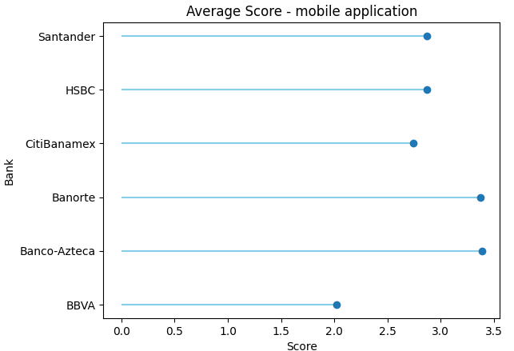

# What NLP Reveals About Mexican Banking Apps

- [Context](#context)
- [Market Share and Competitors in Mexican Banking Apps](#market-share-and-competitors-in-mexican-banking-apps)
   + [Data exploring](data_explorer.ipynb)
- [ML models](#ml-models)
   + [building the model](loyalty_drivers.ipynb)
- [Most important features](#most-important-features)
   + [building SHAP values](loyalty_drivers.ipynb)
- [Budget optimization](#budget-optimization)
   + [building the optimization model](optimizing_loyalty.ipynb)
- [What if scenario](#what-if-scenario)
   + [DiCE model](optimizing_loyalty.ipynb)
- [Findings](#findings)

## Context

The **Comisión Nacional Bancaria y de Valores (CNBV)** reports a remarkable surge in mobile banking usage in Mexico. By the first quarter of 2024, 87 million accounts were actively transacting via mobile devices—a significant jump from 82 million accounts recorded just two quarters earlier, in Q3 2023. This upward trend reflects the growing reliance on mobile technology for convenient and accessible financial transactions.

Since Q1 2017, mobile banking accounts in Mexico have grown more than sevenfold, skyrocketing from 11.8 million to the current 87 million, with an impressive average annual growth rate of 14.2%. This rapid expansion underscores the increasing importance of mobile platforms in Mexico’s financial ecosystem.

However, the adoption of mobile banking is not uniform across the country. Regions such as the northern states and the Yucatán Peninsula are at the forefront of digital inclusion, while Mexico City leads the way with exceptional penetration rates. In 2023, Mexico City recorded 18.4 million mobile accounts—more than double its adult population of 7.3 million. This equates to a staggering 253 mobile banking accounts per 100 adults, highlighting the capital’s strong embrace of digital banking.

## Market Share and Competitors in Mexican Banking Apps

Six major groups hold 96% of mobile-linked bank accounts. Among them, Grupo Santander holds a 10.24% share, while BBVA and Banco Azteca stand out as market leaders, showcasing rapid growth in their market share.

### Banking Industry Benchmark Analysis

- **Deposit Growth Trends**
  - *Banco Azteca* led the growth in the number of accounts between Q4 2023 and Q1 2024, with a 5.1% increase. In contrast, *Grupo Santander* saw a decline of -0.81%, falling below the market average of 0.94%. This suggests a potential customer shift towards other institutions.
  
- **Credit Market Insights**
  - *Santander* holds a notable position in the credit market with an 8.43% share. However, it lags significantly behind *BBVA*, which commands 20.11%, and *Banco Azteca*, the market leader with 24.39%.
  
- **Delinquency Rates**
  - In 2024, *Grupo Santander* reported a delinquency rate of 2.26%, higher than *BBVA's* 1.67%, but notably lower than *Banco Azteca's* 3.49%. This indicates that while *Banco Azteca* has expanded its customer base, it faces a higher credit risk among its clients.
  
- **Conclusion**
  - *Banco Azteca's* aggressive growth in account numbers and its dominant position in the credit market highlight its expanding influence in the financial sector. However, this rapid expansion comes with increased credit risk, as reflected in its higher delinquency rates. Meanwhile, *Grupo Santander*, despite a respectable share in the credit market, faces challenges with declining deposits and relatively higher delinquency compared to *BBVA*. These trends suggest that while *Banco Azteca* is capitalizing on growth opportunities, maintaining credit quality will be crucial for sustainable success. Conversely, *Grupo Santander* may need to focus on improving customer retention and managing credit risk to remain competitive.
 
### Analyzing Customer Experience in Banking Apps

An analysis of user ratings on **Google Play** highlights a clear hierarchy among Mexico's mobile banking apps. **Banorte** and **Banco Azteca** emerge as the top performers, earning high marks for customer satisfaction and demonstrating well-executed digital strategies. On the other hand, **BBVA** trails behind, signaling substantial room for improvement in delivering a better user experience. **Santander**, while not leading, secures a respectable third place with steady performance.

To deepen the analysis, we examined highlighted reviews—those deemed most relevant or popular by users. These reviews provide valuable insights into customer sentiment, revealing key preferences, recurring pain points, and desired features. This feedback offers a treasure trove of actionable intelligence that banks can leverage to refine their apps, enhance user retention, and sharpen their competitive positioning in Mexico's increasingly digital-first financial landscape.

An analysis of average user ratings reveals a notable contrast in performance among Mexico's mobile banking apps. **Banco Azteca** consistently shines as the top performer, achieving the highest levels of user satisfaction. In stark contrast, **BBVA** struggles at the other end of the spectrum, recording the lowest average rating.

This disparity underscores **Banco Azteca's** effective focus on delivering a seamless user experience, setting a benchmark for the industry. Meanwhile, the challenges faced by **BBVA** highlight critical areas for improvement, offering an opportunity to enhance its app’s performance and better align with customer expectations.

### Segmenting the Competitive Landscape of Mexican Banking Apps

By analyzing key factors such as mobile app user ratings, deposit growth trends, credit market insights, delinquency rates, branch networks, and overall market share, we've identified distinct clusters within the customer segments of Mexican banks.

- **Market Leader:** BBVA stands out as the clear frontrunner, dominating the market with a strong user base and extensive branch network. Its leadership position is bolstered by solid deposit growth and a wide-reaching credit market presence.
- **Strong Challengers:** Santander and Banamex are positioned as formidable competitors within the same cluster. They are closely contesting BBVA's lead by enhancing their digital offerings and expanding their market share.
- **Opportunities Cluster:** Banco Azteca emerges in a separate segment we call the **"Opportunities"** cluster. While it shows significant potential for growth, particularly in increasing its market share, it faces challenges with higher delinquency rates. Addressing these issues could unlock substantial improvements in performance and customer satisfaction.
- **Niche & Emerging Players:** Banks like Banregio and HSBC, which hold smaller market shares, fall into the **"Niche & Emerging"** segment. These institutions focus on specific market areas or are leveraging emerging opportunities, highlighting their strategic emphasis on specialized services or untapped markets.

This segmentation not only maps out the current competitive landscape but also sheds light on areas where each bank can innovate and improve. Understanding these clusters allows for targeted strategies to enhance user experience, optimize financial products, and ultimately, strengthen their positions in Mexico's dynamic banking sector.

## The Importance of Sample Size in Analyzing Bank App Reviews

When evaluating user reviews for banking apps, the sample size plays a critical role in ensuring that insights are reliable and representative of the broader user base. An adequate sample size not only enhances the accuracy of your analysis but also minimizes the risk of skewed or biased conclusions. By capturing genuine patterns in user feedback, a well-determined sample size lays the foundation for robust, data-driven decisions.

---

### Why Does Sample Size Matter?
- **Accuracy and Representativeness**
    - A small sample size may fail to capture the overall sentiment or user experience, skewing results with extreme reviews—whether overly positive or negative. In contrast, a larger sample size provides a more balanced perspective, reflecting the true diversity of user feedback.  

- **Statistical Significance**
    - Insufficient sample sizes can lead to conclusions driven by random chance rather than meaningful trends. For instance, if only 20 users out of millions rate an app poorly, this might not indicate a widespread issue. A larger sample size ensures statistical validity, uncovering genuine patterns in the data.  

- **Reduced Margin of Error**
    - Larger sample sizes reduce the margin of error, increasing confidence in your findings. For example, if 5% of users in a small sample rate an app poorly, the actual percentage across the entire user base could differ significantly. A sufficient sample size narrows this discrepancy.  

- **Informed Decision-Making**
    - Banks rely on user reviews to guide product improvements, resolve issues, and prioritize feature updates. A representative sample ensures that decisions are aligned with the needs of the majority, avoiding overreactions to outlier opinions.  

---

### Calculating the Optimal Sample Size
To determine the appropriate sample size for review analysis, consider the following key factors:

- **Desired Confidence Level:** Typically set at 95%, this measures the likelihood that your sample reflects the true population sentiment.
- **Margin of Error:** The acceptable range of deviation from the true value (e.g., ±5%). A smaller margin of error requires a larger sample size.
- **Population Size:** The total number of reviews or users.

You can use this formula to calculate sample size:

$$ n = \frac{Z^2 * p * (1-p)}{e^2} $$

Where:
- n = required sample size
- Z = Z-score (1.96 for a 95% confidence level)
- p = estimated proportion (e.g., percentage of positive reviews, often assumed to be 50% for maximum variability)
- e = margin of error

Ensuring a sufficient sample size is essential for delivering meaningful insights that banks can trust. By prioritizing statistical rigor, you can uncover actionable feedback and support informed, impactful decisions in the competitive world of mobile banking.

---

#### Key Considerations for Analyzing Bank App Reviews

Our analysis highlights two critical factors to consider when determining the appropriate sample size for bank app reviews:

1. **Large User Base Requires Statistically Significant Samples**
    - For bank apps with millions of users, a sample size of around 385 reviews is generally sufficient to achieve a 95% confidence level, as previously calculated. This ensures that the insights drawn are both statistically significant and representative of the broader user experience, enabling banks to make data-driven decisions with confidence.  

2. **High Variability in User Feedback**
    - Reviews for banking apps often vary significantly due to factors such as device compatibility, regional differences, and individual expectations. To address this variability, an estimated proportion (𝑝) of 0.5 is recommended in sample size calculations. This assumption maximizes variability, enhancing the reliability of the analysis by accounting for a wide range of possible user sentiments.  

By considering these factors, banks can ensure that their review analysis is robust, reflective of the diverse customer base, and capable of uncovering actionable insights to improve their digital offerings.

---

#### Key Findings from the Analysis

With a robust sample size ensuring statistical reliability, our analysis reveals clear winners and areas of opportunity within Mexico’s mobile banking app landscape.

- **Top Performers: Banorte and Banco Azteca**
    - Banorte and Banco Azteca stand out as the highest-rated banking apps, consistently receiving positive feedback from users. Their strong user ratings reflect well-executed digital strategies and a customer-centric approach that clearly resonates with their audience.  

- **Opportunity for Improvement: BBVA**
    - Despite being the market leader in Mexico, BBVA lags behind in app performance, as indicated by user feedback. While its large customer base gives it a strategic advantage, the app’s lower ratings highlight key areas for improvement. Addressing these pain points presents a valuable opportunity for BBVA to strengthen its user experience and solidify its competitive position in an increasingly digital-first market.  

These findings provide a roadmap for understanding user sentiment and identifying where banks should focus their digital transformation efforts to stay ahead in Mexico's fast-evolving banking sector.

## Why Does ANOVA Matter?

Banks rely on user feedback to gauge customer satisfaction and improve their digital offerings. By applying ANOVA, we can confidently identify which banking apps are performing better and which ones have room for improvement. This approach provides data-backed insights, allowing banks to move beyond speculation and make strategic decisions that directly impact user experience.

- For instance:
    - BBVA may have a lower user rating compared to Banorte and Banco Azteca, but is this difference significant enough to require action?
    - ANOVA helps answer this question with statistical rigor, ensuring that banks allocate resources to areas with the most potential impact.

### Checking Assumptions Before Running ANOVA

Before applying ANOVA, it's essential to ensure that certain statistical assumptions are met. Two key assumptions are:

1. Normal Distribution: User ratings should follow a normal distribution.
2. Homogeneity of Variances: The variance of ratings across bank apps should be similar.

If these assumptions are violated, ANOVA may produce misleading results. To address this, a non-parametric test like the Kruskal-Wallis test can be used as an alternative. Unlike ANOVA, the Kruskal-Wallis test does not require normality or homogeneity of variances, making it a more flexible option for analyzing user feedback that doesn't fit the ideal distribution.

By leveraging ANOVA (or its non-parametric alternative) to analyze app ratings, banks can gain a deeper understanding of customer sentiment, prioritize areas for improvement, and maintain a competitive edge in Mexico's fast-growing mobile banking market.

### When Normality Fails: Using the Kruskal-Wallis Test to Compare Banking App Ratings

In our previous analysis, we observed that user ratings do not follow a normal distribution, which is a key assumption for applying ANOVA. This means that using ANOVA in this context could lead to inaccurate conclusions.

**The Alternative: Kruskal-Wallis Test**  
When the assumption of normality is violated, the Kruskal-Wallis test becomes a more suitable option. This non-parametric statistical test is designed to compare the medians of two or more independent groups, rather than their means, to determine if there are significant differences between them. Unlike ANOVA, it does not require the data to follow a normal distribution or exhibit homogeneity of variances.

**Why Use the Kruskal-Wallis Test?**
- *Robust to Non-Normal Data:* Unlike ANOVA, the Kruskal-Wallis test works well with data that deviate from normality, making it ideal for analyzing user ratings from app reviews.
- *Focus on Medians, Not Means:* Since the test compares medians, it provides a more accurate assessment of differences in central tendency, especially when extreme values (outliers) could skew the results.
- *Applicable to Multiple Groups:* Like ANOVA, it allows for the comparison of three or more groups—perfect for assessing user feedback across banking apps like BBVA, Banorte, and Banco Azteca.

By using the Kruskal-Wallis test, we ensure that our analysis remains statistically sound, even in the face of non-normal data. This approach provides a more accurate view of how customer sentiment differs across banking apps, allowing banks to make well-informed, data-driven improvements to their digital platforms.

#### Dunn's Test: Pinpointing Specific Differences in Bank App Ratings

When analyzing multiple banking apps, tests like ANOVA or Kruskal-Wallis help us determine if there is a significant difference between the groups. However, these tests only reveal that a difference exists — they don't tell us which specific groups are different. This is where Dunn's Test becomes essential.

**What is Dunn's Test?**

Dunn's Test is a post hoc analysis used after detecting a significant difference with a Kruskal-Wallis or ANOVA test. Its main purpose is to conduct pairwise comparisons between groups, allowing us to identify exactly which pairs of groups differ significantly.

For example, imagine we have three banks:
- Bank A
- Bank B
- Bank C

If a Kruskal-Wallis test reveals a significant difference among these banks, Dunn's Test would then compare the groups as follows:
- Bank A vs. Bank B
- Bank A vs. Bank C
- Bank B vs. Bank C

If the comparison between Bank A and Bank B shows a p-value below 0.05, this indicates a statistically significant difference in user ratings between the two banks.

**Why is Dunn's Test Important?**

1. Identifies Specific Differences
    - While Kruskal-Wallis tells us that "at least one bank is different," Dunn's Test reveals which banks differ. This is crucial for identifying specific competitors that are outperforming or underperforming.

2. Reduces Risk of Error
    - When making multiple comparisons, the chance of a false positive (Type I error) increases. Dunn’s Test addresses this by adjusting p-values using methods like the Bonferroni correction, ensuring that the results remain statistically sound.

3. Drives Targeted Improvement
    - Knowing which specific banks have better or worse ratings allows for targeted action. For example, if Bank A significantly underperforms compared to Bank B, the insights can be used to prioritize feature updates, resolve customer pain points, or refine marketing strategies.

**Summary**
- Use Dunn's Test after identifying significant differences with Kruskal-Wallis or ANOVA.
- It identifies which specific banks differ by conducting pairwise comparisons.
- It reduces the risk of false positives by adjusting for multiple comparisons (e.g., using the Bonferroni correction).
- It helps banks take targeted action to address specific weaknesses and close performance gaps.
- By incorporating Dunn's Test into your analysis, you can move beyond general observations and take precise, data-driven actions to improve customer satisfaction and maintain a competitive edge in the banking app landscape.

## Key Findings: Uncovering Differences in Banking App Ratings
Our analysis reveals statistically significant differences in user ratings among the key competitors in the market. By leveraging statistical methods like the Kruskal-Wallis test and Dunn's Test, we were able to pinpoint which banks are outperforming their rivals and, more importantly, where improvements are needed.

### Why Do These Findings Matter?

Identifying significant differences in app performance provides actionable insights that go beyond basic observations. This analysis allows banks to prioritize initiatives that have a direct impact on customer experience and market positioning. Here’s how it can be applied:

- Pinpoint Areas for Improvement
    - By identifying which banks are underperforming relative to their competitors, specific pain points can be addressed, such as app speed, user interface, or security concerns.
- Optimize User Experience
    - Addressing user complaints and improving app features leads to a more seamless and enjoyable customer experience, directly impacting user satisfaction.
- Data-Driven Decision Making
    - Instead of relying on assumptions, banks can make informed decisions on which app features to enhance, which pain points to prioritize, and which competitor strategies to follow or counter.

### Why It Matters for Business Growth

Enhancing user experience isn't just about satisfaction — it has a direct impact on business outcomes:
- Higher Customer Retention: A better app experience reduces churn, keeping customers engaged and loyal.
- Increased Customer Loyalty: Positive user experiences drive long-term brand loyalty and encourage repeat usage.
- Higher Conversions & Engagement: A well-performing app can lead to higher engagement, more transactions, and increased app usage.

By focusing on the findings from the Kruskal-Wallis and Dunn’s Test, banks can adopt a more strategic approach to product development, driving better customer experiences and ultimately improving market share and brand loyalty.

